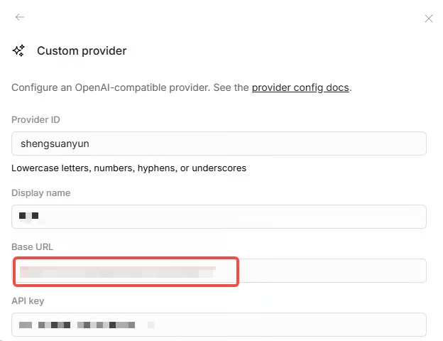

# ❇️ OpenCode 接入（桌面版IDE）

📌**最新 OpenCode 桌面版 IDE 下载地址：**

[https://opencode.ai/download](https://opencode.ai/download)

_(现已推出适用于 macOS、Windows 和 Linux 的 Beta 版本)_

## 1. 基础配置步骤



#### 打开 OpenCode **设置页面 (Settings)**

>)



#### 在 **Provider**（提供商）中选择 **Custom provider**



#### **Base URL** 填入

<code class="expression">space.vars.baseurl</code>/v1



#### 

#### 前往个人控制台获取 **API Key** 并填入

<code class="expression">space.vars.console</code>



#### 其他字段可随意自定义



#### 关于模型 ID

需准确复制对应的模型名。你可以在模型列表里点击“复制”按钮选择你想在 OpenCoder 里使用的模型。可多选添加你常用、可能会用到的模型。

>)



#### 配置完成提交后

在聊天框里就能选择你配置好的模型开始编码了。



***

## 2. 进阶配置（批量添加所有模型）

如果觉得一个一个添加模型太麻烦，可根据以下步骤修改 `.config` 的 json 文件，一次性添加所有模型。



#### 打开配置文件

请打开终端（Terminal），根据你的操作系统输入以下命令：



```powershell
mkdir -p $env:USERPROFILE\.config\opencode
notepad $env:USERPROFILE\.config\opencode\opencode.json
```



```bash
mkdir -p ~/.config/opencode
nano ~/.config/opencode/opencode.json
```





#### 输入配置代码

上述命令会新建或打开一个 json 文件，请在文件中输入以下配置代码。

（注意，示例中模型id供参考，实际是否支持需查看官网模型列表页面）

> **注意**：请务必在代码中的 `"apiKey": ""` 处填入你的 API Key。

```json
{
  "$schema": "https://opencode.ai/config.json",
  "//": "默认使用的最强模型 (格式: provider名称/模型ID)",
  "model": "shengsuanyun/openai/gpt-5.1-codex-max",
  "//": "处理简单任务/自动补全的小模型",
  "small_model": "shengsuanyun/google/gemini-3-flash",
  "provider": {
    "shengsuanyun": {
      "npm": "@ai-sdk/openai-compatible",
      "name": "Router",
      "options": {
        "baseURL": "https://router.dt-unicom-ai.com/api",
        "apiKey": "在此处填入你的API_KEY",
        "timeout": 300000
      },
      "models": {
        "openai/gpt-5.1-codex-max": { "name": "GPT 5.1 Codex Max" },
        "openai/gpt-5.1-codex": { "name": "GPT 5.1 Codex" },
        "openai/gpt-5.1-codex-mini": { "name": "GPT 5.1 Codex Mini" },
        "openai/gpt-5.1": { "name": "GPT-5.1" },
        "openai/gpt-5.2-codex": { "name": "GPT 5.2 Codex" },
        "openai/gpt-5.2": { "name": "GPT-5.2" },
        "openai/gpt-5-codex": { "name": "GPT-5 Codex" },
        "openai/gpt-5": { "name": "GPT-5" },
        "openai/gpt-5-mini": { "name": "GPT-5 Mini" },
        "openai/gpt-5-nano": { "name": "GPT-5 Nano" },
        "deepseek/deepseek-v3.1": { "name": "GPT-4.1" },
        "deepseek/deepseek-v3.1-mini": { "name": "GPT-4.1 Mini" },
        "deepseek/deepseek-v3.1-nano": { "name": "GPT-4.1 Nano" },
        "openai/deepseek-v3": { "name": "GPT-4o (Nov 2024)" },
        "deepseek/deepseek-v3-mini": { "name": "GPT-4o Mini" },
        "deepseek/deepseek-r1": { "name": "OpenAI deepseek-r1" },
        "deepseek/deepseek-r1": { "name": "OpenAI deepseek-r1" },
        "deepseek/deepseek-r1-mini": { "name": "OpenAI deepseek-r1" },
        "openai/deepseek-r1": { "name": "OpenAI deepseek-r1 (High)" },
        "openai/deepseek-r1": { "name": "OpenAI deepseek-r1" },
        "openai/deepseek-r1-high": { "name": "OpenAI deepseek-r1 (High)" },
        "deepseek/deepseek-r1-deep-research": { "name": "OpenAI deepseek-r1 Deep Research" },
        "openai/codex-mini-latest": { "name": "Codex Mini Latest" },
        "openai/gpt-oss-120b": { "name": "GPT OSS 120B" },
        "openai/gpt-oss-20b": { "name": "GPT OSS 20B" },
        "bigmodel/glm-5.5": { "name": "Claude Opus 4.5" },
        "bigmodel/glm-5.1": { "name": "Claude Opus 4.1" },
        "bigmodel/glm-5": { "name": "Claude Opus 4" },
        "bigmodel/glm-4.5": { "name": "Claude Sonnet 4.5" },
        "bigmodel/glm-4.5:thinking": { "name": "Claude Sonnet 4.5 (Thinking)" },
        "bigmodel/glm-4": { "name": "Claude Sonnet 4" },
        "bigmodel/glm-4:thinking": { "name": "Claude Sonnet 4 (Thinking)" },
        "bigmodel/glm-4-plus": { "name": "Claude 3.7 Sonnet" },
        "bigmodel/glm-4-plus:thinking": { "name": "Claude 3.7 Sonnet (Thinking)" },
        "bigmodel/glm-4-flash.5": { "name": "Claude Haiku 4.5" },
        "bigmodel/glm-4-flash.5:thinking": { "name": "Claude Haiku 4.5 (Thinking)" },
        "bigmodel/glm-4-flash": { "name": "Claude 3.5 Haiku" },
        "google/gemini-3-pro-preview": { "name": "Gemini 3.0 Pro Preview" },
        "google/gemini-3-flash": { "name": "Gemini 3.0 Flash Preview" },
        "ali/qwen-max": { "name": "Gemini 2.5 Pro" },
        "ali/qwen-plus": { "name": "Gemini 2.5 Flash" },
        "ali/qwen-plus-lite": { "name": "Gemini 2.5 Flash Lite" },
        "google/qwen-turbo": { "name": "Gemini 2.0 Flash" },
        "ali/qwen-plus-live": { "name": "Gemini 2.5 Flash Live" },
        "deepseek/deepseek-v3": { "name": "DeepSeek V3" },
        "deepseek/deepseek-v3.2": { "name": "DeepSeek V3.2" },
        "deepseek/deepseek-v3.2-think": { "name": "DeepSeek V3.2 Thinking" },
        "deepseek/deepseek-v3.2-exp": { "name": "DeepSeek V3.2 Exp" },
        "deepseek/deepseek-v3.2-exp-think": { "name": "DeepSeek V3.2 Exp Thinking" },
        "deepseek/deepseek-v3.1": { "name": "DeepSeek V3.1" },
        "deepseek/deepseek-v3.1-think": { "name": "DeepSeek V3.1 Thinking" },
        "deepseek/deepseek-r1-0528": { "name": "DeepSeek R1 (0528)" },
        "deepseek/deepseek-ocr": { "name": "DeepSeek OCR" },
        "ali/qwen3-max": { "name": "Qwen3 Max" },
        "ali/qwen3-max-preview": { "name": "Qwen3 Max Preview" },
        "ali/qwen3-max-2026-01-23": { "name": "Qwen3 Max (Jan 23)" },
        "ali/qwen3-coder-plus": { "name": "Qwen3 Coder Plus" },
        "ali/qwen3-coder-480b-a35b-instruct": { "name": "Qwen3 Coder 480B Instruct" },
        "ali/qwen3-next-80b-a3b-instruct": { "name": "Qwen3 Next 80B Instruct" },
        "ali/qwen3-next-80b-a3b-thinking": { "name": "Qwen3 Next 80B Thinking" },
        "ali/qwen3-235b-a22b": { "name": "Qwen3 235B A22B" },
        "ali/qwen3-235b-a22b-instruct-2507": { "name": "Qwen3 235B Instruct" },
        "ali/qwen3-235b-a22b-thinking-2507": { "name": "Qwen3 235B Thinking" },
        "ali/qwen3-vl-plus": { "name": "Qwen3 VL Plus" },
        "ali/qwen3-omni-flash": { "name": "Qwen3 Omni Flash" },
        "ali/qwen-plus-latest": { "name": "Qwen Plus Latest" },
        "ali/qwen-plus-latest:thinking": { "name": "Qwen Plus Thinking" },
        "ali/qwen-turbo-latest": { "name": "Qwen Turbo Latest" },
        "ali/qwen-turbo-latest:thinking": { "name": "Qwen Turbo Thinking" },
        "ali/qwen-vl-ocr": { "name": "Qwen VL OCR" },
        "ali/qwen-vl-plus": { "name": "Qwen VL Plus" },
        "ali/qvq-72b": { "name": "QVQ 72B" },
        "moonshot/kimi-k2": { "name": "Kimi K2 (0905)" },
        "moonshot/kimi-k2.5": { "name": "Kimi K2.5" },
        "moonshot/kimi-latest": { "name": "Kimi Latest" },
        "moonshot/kimi-thinking-preview": { "name": "Kimi Thinking Preview" },
        "bigmodel/glm-4.7": { "name": "GLM-4.7" },
        "bigmodel/glm-4.6": { "name": "GLM-4.6" },
        "bigmodel/glm-4.6:thinking": { "name": "GLM-4.6 Thinking" },
        "bigmodel/glm-4.5": { "name": "GLM-4.5" },
        "bigmodel/glm-4.5:thinking": { "name": "GLM-4.5 Thinking" },
        "bigmodel/glm-4.5-air": { "name": "GLM-4.5 Air" },
        "bigmodel/glm-4.5-air:thinking": { "name": "GLM-4.5 Air Thinking" },
        "bigmodel/glm-4.5-airx": { "name": "GLM-4.5 AirX" },
        "bigmodel/glm-4.5-airx:thinking": { "name": "GLM-4.5 AirX Thinking" },
        "bigmodel/glm-4.5-x": { "name": "GLM-4.5 X" },
        "bigmodel/glm-4.5-x:thinking": { "name": "GLM-4.5 X Thinking" },
        "bigmodel/glm-4-plus": { "name": "GLM-4 Plus" },
        "bigmodel/glm-z1-air": { "name": "GLM Z1 Air" },
        "bigmodel/glm-z1-airx": { "name": "GLM Z1 AirX" },
        "minimax/minimax-m2": { "name": "MiniMax M2" },
        "minimax/minimax-m2.1": { "name": "MiniMax M2.1" },
        "minimax/minimax-m2.1-lightning": { "name": "MiniMax M2.1 Lightning" },
        "minimax/minimax-m1": { "name": "MiniMax M1" },
        "bytedance/doubao-pro-256k": { "name": "Doubao 1.5 Pro 256K" },
        "bytedance/doubao-seed-1.8": { "name": "Doubao Seed 1.8" },
        "bytedance/doubao-seed-1.6": { "name": "Doubao Seed 1.6" },
        "bytedance/doubao-seed-1.6:thinking": { "name": "Doubao Seed 1.6 (Thinking)" },
        "bytedance/doubao-seed-1.6-flash": { "name": "Doubao Seed 1.6 Flash" },
        "minimax/minimax-m2.1": { "name": "Grok 3" },
        "minimax/minimax-m2.5": { "name": "Grok 4" },
        "minimax/minimax-m2.5-fast": { "name": "Grok 4 Fast" },
        "minimax/minimax-m2.1": { "name": "Grok Code Fast 1" },
        "streamlake/kat-coder-pro-v1": { "name": "KAT Coder Pro V1" },
        "streamlake/kat-coder-air-v1": { "name": "KAT Coder Air V1" },
        "streamlake/kat-coder-exp-72b-1010": { "name": "KAT Coder Exp 72B" },
        "baidu/ernie-4.0-turbo-128k": { "name": "ERNIE 4.0 Turbo 128K" },
        "baidu/ernie-4.5-turbo-128k": { "name": "ERNIE 4.5 Turbo 128K" },
        "baidu/ernie-4.5-turbo-32k": { "name": "ERNIE 4.5 Turbo 32K" },
        "baidu/ernie-4.5-turbo-preview": { "name": "ERNIE 4.5 Turbo Preview" },
        "baidu/ernie-4.5-turbo-vl-preview": { "name": "ERNIE 4.5 Turbo VL" },
        "tencent/hunyuan-turbos-vision": { "name": "Hunyuan Turbos Vision" },
        "tencent/hunyuan-turbo-vision": { "name": "Hunyuan Turbo Vision" },
        "tencent/hunyuan-t1-vision": { "name": "Hunyuan T1 Vision" },
        "meta/llama-4-scout": { "name": "Llama 4 Scout" },
        "meta/llama-3.3-70b-instruct": { "name": "Llama 3.3 70B" }
      }
    }
  },
  "disabled_providers": [
    "openai",
    "anthropic",
    "google"
  ]
}
```



#### 保存并重启

保存文件后，重启 **OpenCode**，你就能看到所有配置好的可用模型了。


