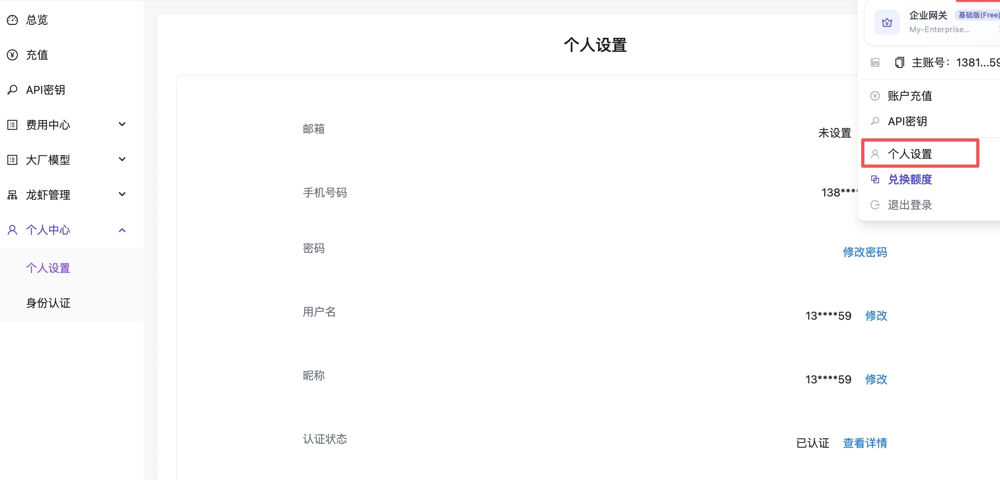
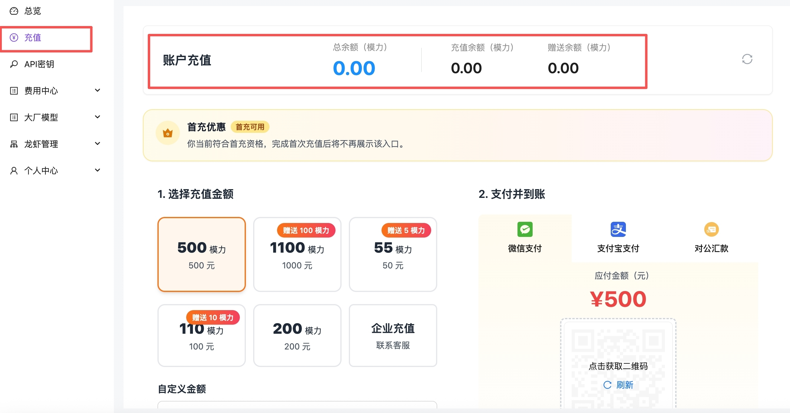
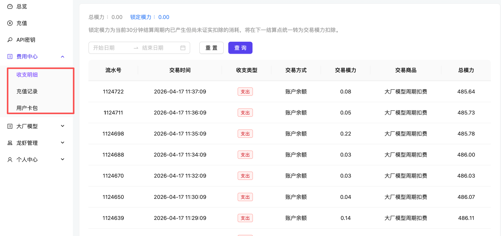

# 账号指南

> 本文将帮助您完成账号注册、登录、密码修改、实名认证、充值等基本操作，引导您顺利开始使用<code class="expression">space.vars.mainname</code>服务。

***

### **注册账号**

您可以通过手机号完成注册。**注册流程：**

1. 打开 官网( <code class="expression">space.vars.homeurl</code> )，点击页面右上角 「登录」。
2. 输入手机号，获取验证码，点击登录（未注册用户将自动注册）。
3. 首次登录后，请根据页面提示完成账号配置。

 

| 配置项  | 必选/可选 | 配置说明                                                                |
| ---- | ----- | ------------------------------------------------------------------- |
| 用户名  | 必选    | 设置您的账号名称，设置成功后可在`控制台 > 账号 > 账号设置`中修改                                |
| 密码   | 必选    | 设置您的登录密码                                                            |
| 确认密码 | 必选    | 再次设置您的登录密码，确保前后一致                                                   |
| 手机号码 | 必选    | 输入未在 <code class="expression">space.vars.mainname</code> 平台注册过的手机号码 |
| 验证码  | 必选    | 输入手机验证码                                                             |

5. 配置完成后，系统将在 3 秒内自动登录。

***

### **登录账号**

您可以使用以下任一方式登录<code class="expression">space.vars.mainname</code>平台：

* 使用手机号（短信验证码登录）。
* 使用账号名（密码登录）。

**登录流程：**

1. 打开 官网( <code class="expression">space.vars.homeurl</code> )，点击右上角 「登录」。
2. 在登录页面选择登录方式，输入相应信息完成登录。

**手机号登录**

输入手机号并获取短信验证码。

| 配置项   | 必选/可选 | 配置说明        |
| ----- | ----- | ----------- |
| 手机号   | 必选    | 输入已经注册的手机号  |
| 获取验证码 | 必选    | 点击`获取验证码`按钮 |
| 输入验证码 | 必选    | 输入短信验证码     |

***

**账号名 + 密码登录**

适用于已设置账号名的用户。

| 配置项  | 必选/可选 | 配置说明       |
| ---- | ----- | ---------- |
| 用户名  | 必选    | 输入已经注册的用户名 |
| 输入密码 | 必选    | 输入账号密码     |

***

### **修改账号密码**

账号密码是保障账户安全的核心，请定期更新。**修改流程：**

1. 登录 控制台( <code class="expression">space.vars.console</code>)。
2. 在左侧菜单栏点击 「个人中心 > 个人设置」，进入账号设置页面。
3. 点击 「修改密码」，弹出修改密码框。
4. 输入原密码、新密码，点击 「确认」 完成修改。

| 配置项  | 必选/可选 | 配置说明         |
| ---- | ----- | ------------ |
| 旧密码  | 必选    | 输入当前账号的密码    |
| 新密码  | 必选    | 设置账号新密码      |
| 确认密码 | 必选    | 输入新密码，确保前后一致 |

### **实名认证**

为确保账户安全，需完成实名认证。**认证流程：**

1. 登录 控制台( <code class="expression">space.vars.console</code>)，在左侧菜单栏点击 「个人中心 > 身份认证置」。
2. 点击 「个人支付宝扫码 > 立即认证」。
3. 使用支付宝扫描弹框二维码并完成认证。

> 如需企业认证，可上传营业执照和填写法人身份证号，或联系客服手动登记。

***

### **账户充值**

支持微信、支付宝扫码支付与企业对公汇款。**充值流程：**

1. 点击右上角账号头像，在下拉菜单中选择 「充值」。
2. 进入充值界面，选择充值金额。
3. 选择支付方式（支付宝 / 微信），刷新二维码完成扫码支付。
4. 支付成功后，请在 控制台( <code class="expression">space.vars.console</code>) 查看余额。

> 企业对公汇款请联系 [人工客服](zhang-hao-zhi-nan.md#%E5%AE%98%E6%96%B9%E5%AE%A2%E6%9C%8D%E5%92%8C%E4%BA%A4%E6%B5%81%E7%BE%A4) 开通服务。

***

### **查看模型使用记录**

您可以在 控制台( <code class="expression">space.vars.console</code>) 查看 API 使用记录与账号消耗详情。**操作步骤：**

1. 点击右上角账号头像，进入控制台。
2. 点击左侧菜单栏 「费用中心」 查看调用情况。

***

### **官方客服和交流群**

如有问题，欢迎联系官方客服或进入开发者交流群获取支持。

<figure><figcaption></figcaption></figure>
